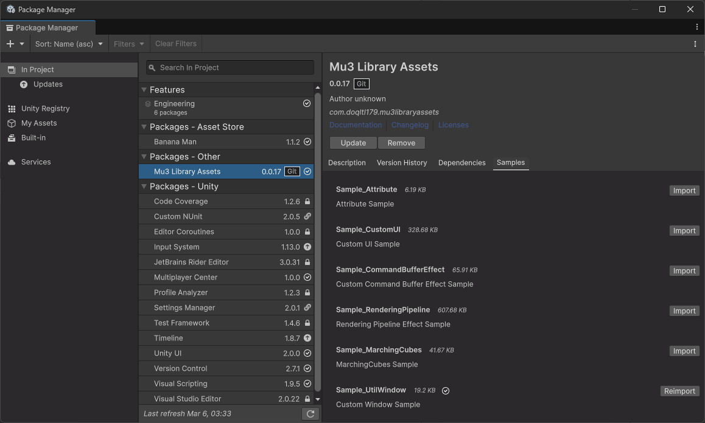

# How To Import
- Open 'Package Manager' in Editor
- Click '+' button. And click 'Add package from git URL...' on list.
- Write 'https://github.com/doqltl179/Mu3Library_ForUnity.git?path=Assets/Mu3LibraryAssets'. And click 'Add' button.

# Samples

    

When you finish importing this package, please check the samples in 'Package Manager'.
